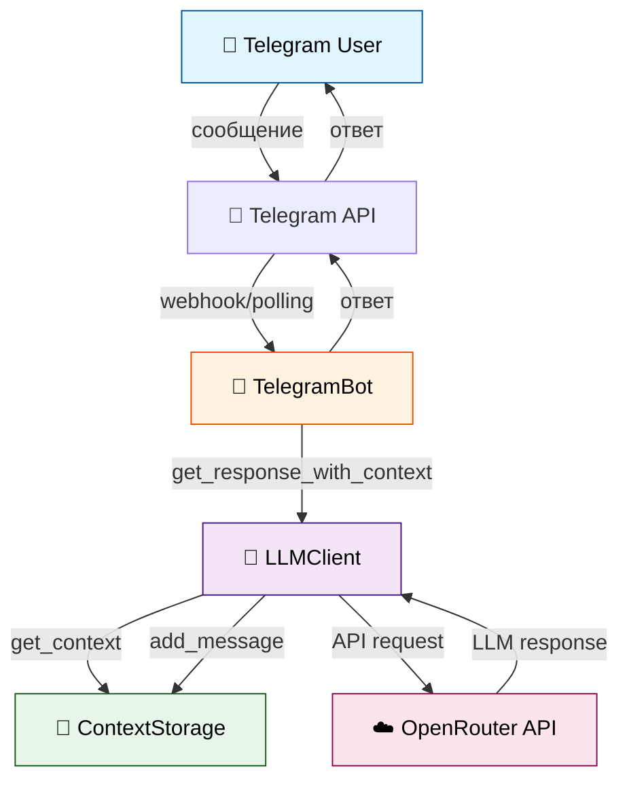
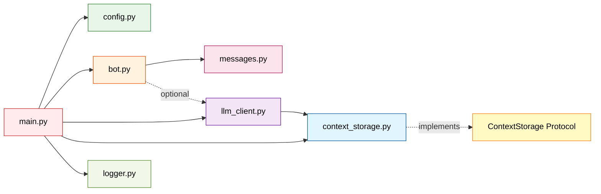

# 🏗️ Архитектура системы

> Высокоуровневое описание архитектурных решений и взаимодействия компонентов

---

## 📊 Архитектурная диаграмма



---

## 🧩 Компоненты системы

### 1. TelegramBot (`src/bot.py`)

**Ответственность:** Обработка команд и сообщений Telegram

**Ключевые методы:**
- `cmd_start()` - приветствие
- `cmd_help()` - список команд
- `cmd_role()` - отображение роли бота
- `cmd_reset()` - очистка контекста
- `handle_message()` - обработка текстовых сообщений

**Зависимости:**
- `LLMClient` (optional) - для получения ответов от LLM
- `Logger` - для логирования событий
- `BotMessages` - текстовые константы

**Паттерны:**
- Decorator `@log_command` для логирования команд
- Edge case handling (пустые/длинные сообщения)

---

### 2. LLMClient (`src/llm_client.py`)

**Ответственность:** Взаимодействие с OpenRouter API

**Ключевые методы:**
- `get_response()` - одиночный запрос без контекста
- `get_response_with_context()` - запрос с историей диалога
- `reset_context()` - очистка истории пользователя

**Зависимости:**
- `AsyncOpenAI` - асинхронный клиент OpenAI
- `ContextStorage` - абстракция хранилища контекста (DI)
- `Logger` - логирование запросов/ответов

**Паттерны:**
- Dependency Injection (pluggable storage)
- Async/await для всех операций

---

### 3. ContextStorage (`src/context_storage.py`)

**Ответственность:** Хранение истории диалогов

**Интерфейс (Protocol):**
```python
class ContextStorage(Protocol):
    def add_message(user_id: int, role: str, content: str) -> None
    def get_context(user_id: int) -> List[Dict[str, str]]
    def reset_context(user_id: int) -> None
```

**Реализация:** `InMemoryContextStorage`
- Хранение в памяти (dict)
- Лимит: 20 сообщений на пользователя
- Лимит: 1000 пользователей
- LRU стратегия при превышении лимита

**Паттерны:**
- Protocol-based design (готовность к замене на Redis/DB)
- SRP - только хранение контекста

---

### 4. Config (`src/config.py`)

**Ответственность:** Управление конфигурацией

**Структура:**
- Immutable dataclass (frozen=True)
- Валидация обязательных полей
- Значения по умолчанию

**Ключевые методы:**
- `from_env()` - загрузка из .env с валидацией
- `load_system_prompt()` - загрузка промпта из файла

**Паттерны:**
- Immutability (frozen dataclass)
- Factory method (`from_env()`)
- Custom exception (`ConfigError`)

---

### 5. BotMessages (`src/messages.py`)

**Ответственность:** Текстовые константы бота

**Структура:**
- Статические методы для всех сообщений
- Форматирование с параметрами
- Централизованное хранение текстов

**Паттерны:**
- Static methods (no state)
- SRP - только тексты

---

## 🔄 Поток обработки сообщения

```mermaid
sequenceDiagram
    participant U as User
    participant B as TelegramBot
    participant L as LLMClient
    participant S as ContextStorage
    participant O as OpenRouter

    U->>B: Текстовое сообщение
    B->>B: handle_message()
    B->>B: Валидация (длина, пустота)
    B->>L: get_response_with_context(user_id, text)

    L->>S: add_message(user_id, "user", text)
    S->>S: Добавить в историю

    L->>S: get_context(user_id)
    S-->>L: История последних 20 сообщений

    L->>O: chat.completions.create(messages)
    O-->>L: LLM response

    L->>S: add_message(user_id, "assistant", response)
    S->>S: Добавить в историю

    L-->>B: Ответ LLM
    B->>U: Отправить ответ

    style U fill:#e1f5ff,stroke:#01579b,color:#000
    style B fill:#fff3e0,stroke:#e65100,color:#000
    style L fill:#f3e5f5,stroke:#4a148c,color:#000
    style S fill:#e8f5e9,stroke:#1b5e20,color:#000
    style O fill:#fce4ec,stroke:#880e4f,color:#000
```

---

## 🎯 Архитектурные принципы

### SOLID принципы

#### Single Responsibility
- `TelegramBot` - только Telegram
- `LLMClient` - только LLM API
- `ContextStorage` - только хранение
- `BotMessages` - только тексты

#### Open/Closed
- `ContextStorage` Protocol позволяет добавлять реализации
- Закрыт для модификации (interface не меняется)

#### Liskov Substitution
- Любая реализация `ContextStorage` взаимозаменяема

#### Interface Segregation
- Минимальные интерфейсы (Protocol с 3 методами)

#### Dependency Inversion
- `LLMClient` зависит от `ContextStorage` Protocol, не от конкретной реализации
- Внедрение через конструктор (DI)

---

### Другие принципы

#### KISS (Keep It Simple, Stupid)
- Один класс = один файл
- Минимальная вложенность
- Нет абстракций "на будущее"

#### DRY (Don't Repeat Yourself)
- Декоратор `@log_command` вместо дублирования
- `BotMessages` вместо hardcoded текстов
- Общие фикстуры в `conftest.py`

#### Async-first
- Весь код асинхронный (async/await)
- Не блокирующие операции

---

## 🔌 Точки расширения

### 1. Добавить новое хранилище контекста

```python
# src/redis_storage.py
class RedisContextStorage:
    """Redis implementation of ContextStorage."""

    def add_message(self, user_id: int, role: str, content: str) -> None:
        # Redis logic
        pass

    def get_context(self, user_id: int) -> List[Dict[str, str]]:
        # Redis logic
        pass

    def reset_context(self, user_id: int) -> None:
        # Redis logic
        pass

# В main.py заменить:
context_storage = RedisContextStorage(redis_url=config.redis_url)
# Остальной код без изменений!
```

### 2. Добавить новую команду

```python
# В bot.py
@log_command
async def cmd_new_command(self, message: Message) -> None:
    """Обработчик новой команды."""
    await message.answer("Response text")

# В _register_handlers():
self.dp.message.register(self.cmd_new_command, Command("new"))
```

### 3. Изменить роль бота

```bash
# Просто отредактировать файл
vim prompts/system_prompt.txt
# Перезапустить бота
make run
```

---

## 📁 Структура модулей



---

## 🏛️ Архитектурные решения

### Почему Protocol вместо ABC?

- **Structural subtyping** - duck typing для интерфейсов
- **Меньше boilerplate** - не нужно наследование
- **Mypy integration** - статическая проверка типов
- **Гибкость** - любой класс с нужными методами подойдет

### Почему In-Memory storage?

- **MVP требования** - простота важнее масштабируемости
- **Быстрая разработка** - нет зависимостей от внешних сервисов
- **Готовность к замене** - Protocol позволяет легко заменить
- **Достаточно для нагрузки** - до 1000 пользователей

### Почему Immutable Config?

- **Thread-safety** - безопасно в async контексте
- **Предсказуемость** - конфигурация не изменяется после загрузки
- **Debugging** - проще отследить проблемы

### Почему aiogram 3.x?

- **Современный API** - async/await нативно
- **Type hints** - полная типизация из коробки
- **FSM support** - готово к расширению (если понадобится)

---

## 📈 Масштабируемость

### Текущие ограничения

- In-memory storage: до 1000 пользователей
- Single instance: нет горизонтального масштабирования
- Polling mode: медленнее webhook

### Готовность к масштабированию

✅ **Protocol-based storage** - легко заменить на Redis/DB
✅ **Stateless design** - можно запустить multiple instances
✅ **Async architecture** - высокая пропускная способность
⚠️ **Webhook support** - требует изменений в bot.py (polling → webhook)

---

## 🔍 ADR (Architecture Decision Records)

Подробные решения документированы в:
- **docs/ADR.md** - все архитектурные решения проекта

---

## 📚 Дополнительная информация

- **Техническое видение:** docs/VISION.md
- **Тур по коду:** docs/guides/CODEBASE_TOUR.md
- **Процессы разработки:** docs/guides/DEVELOPMENT.md


