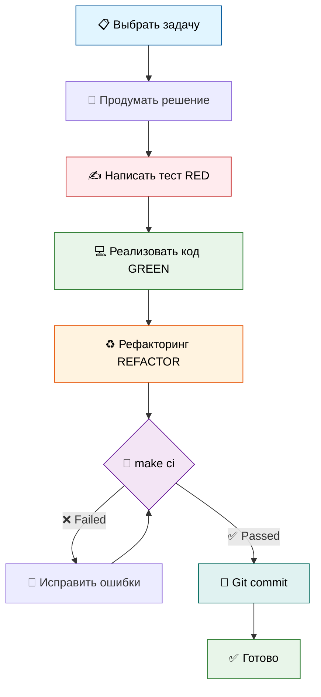

# 🛠️ Процессы разработки

> Руководство по разработке фичей от начала до конца

---

## 🎯 Принципы разработки

### KISS - Keep It Simple, Stupid
- Максимальная простота решений
- Никакого оверинжиниринга
- Никаких абстракций "на будущее"

### ООП
- Один класс = один файл
- Имя файла = имя класса (snake_case для файла)

### Читаемость
- Понятные имена переменных и функций
- Минимальная вложенность (2-3 уровня)
- Код должен быть самоочевидным

### SOLID
- Single Responsibility - один класс, одна ответственность
- Dependency Inversion - зависимость от абстракций (Protocol)

### DRY
- Избегать дублирования кода
- Выносить повторяющуюся логику в функции

---

## 🔄 Workflow разработки



---

## 📝 TDD подход (Red-Green-Refactor)

### Цикл разработки

#### 🔴 RED - Написать failing test

```python
# tests/test_bot.py

@pytest.mark.asyncio
async def test_cmd_new_feature(bot, mock_message):
    """Test new feature command."""
    # Arrange
    mock_message.text = "/newfeature"

    # Act
    await bot.cmd_new_feature(mock_message)

    # Assert
    mock_message.answer.assert_called_once()
    assert "Expected text" in mock_message.answer.call_args[0][0]
```

Запустить:
```bash
make test
# ❌ AttributeError: 'TelegramBot' has no attribute 'cmd_new_feature'
```

---

#### 🟢 GREEN - Минимальная реализация

```python
# src/bot.py

@log_command
async def cmd_new_feature(self, message: Message) -> None:
    """Обработчик новой фичи."""
    if not message.from_user:
        return
    await message.answer("Expected text")

# В _register_handlers():
self.dp.message.register(self.cmd_new_feature, Command("newfeature"))
```

Запустить:
```bash
make test
# ✅ All tests passed
```

---

#### ♻️ REFACTOR - Улучшить код

```python
# 1. Вынести текст в BotMessages
# src/messages.py
@staticmethod
def new_feature_text() -> str:
    return "Expected text with better formatting"

# 2. Использовать в bot.py
await message.answer(BotMessages.new_feature_text())
```

Проверить:
```bash
make ci
# ✅ lint, format, type-check, test - all passed
```

---

## 🧪 Обязательные проверки

### Перед каждым коммитом

```bash
make ci
```

Эта команда выполняет:

1. **Lint (ruff)** - проверка кода
```bash
make lint
```

2. **Format (ruff)** - форматирование
```bash
make format
```

3. **Type-check (mypy)** - проверка типов
```bash
make type-check
```

4. **Test (pytest)** - запуск тестов
```bash
make test
```

**Все проверки должны пройти** ✅

---

## 📐 Стандарты кода

### Type Hints (обязательно!)

```python
# ✅ Хорошо
async def get_response(self, user_message: str) -> str:
    """Получить ответ от LLM."""
    ...

def _add_to_context(self, user_id: int, role: str, content: str) -> None:
    """Добавить сообщение в контекст."""
    ...

# ❌ Плохо
async def get_response(self, user_message):  # Нет типов
    ...
```

### Docstrings (Google Style)

```python
def method_name(self, param1: str, param2: int) -> bool:
    """
    Краткое описание метода.

    Более подробное описание при необходимости.

    Args:
        param1: Описание первого параметра
        param2: Описание второго параметра

    Returns:
        Описание возвращаемого значения

    Raises:
        ValueError: Когда возникает эта ошибка
    """
    ...
```

### Именование

```python
# Файлы
snake_case.py

# Классы
class PascalCase:
    ...

# Функции/методы
def snake_case():
    ...

# Константы
UPPER_SNAKE_CASE = "value"

# Приватные
def _leading_underscore():
    ...
```

---

## 🏗️ Структура изменений

### Добавление нового модуля

1. Создать файл `src/new_module.py`
2. Один класс в файле
3. Добавить docstring класса
4. Реализовать методы с type hints
5. Создать тесты `tests/test_new_module.py`
6. Импортировать в `main.py` (если нужно)
7. Обновить `CODEBASE_TOUR.md`

### Добавление новой команды бота

1. **RED:** Написать тест в `tests/test_bot.py`
```python
async def test_cmd_mycommand(bot, mock_message):
    await bot.cmd_mycommand(mock_message)
    mock_message.answer.assert_called_once()
```

2. **GREEN:** Добавить метод в `src/bot.py`
```python
@log_command
async def cmd_mycommand(self, message: Message) -> None:
    await message.answer(BotMessages.mycommand_text())
```

3. **GREEN:** Зарегистрировать в `_register_handlers()`
```python
self.dp.message.register(self.cmd_mycommand, Command("mycommand"))
```

4. **REFACTOR:** Добавить текст в `src/messages.py`
```python
@staticmethod
def mycommand_text() -> str:
    return "Command response"
```

5. **Проверка:** `make ci`

---

## 🔧 Git workflow

### Коммиты

```bash
# Проверить изменения
git status
git diff

# Обязательная проверка перед коммитом
make ci

# Коммит с понятным сообщением
git add .
git commit -m "feat: add new command /mycommand

- Added cmd_mycommand handler
- Added test coverage
- Updated BotMessages

Refs: TASKLIST.md - Iteration N"
```

### Формат коммитов

```
<type>: <subject>

<body>

<footer>
```

**Types:**
- `feat:` - новая фича
- `fix:` - исправление бага
- `refactor:` - рефакторинг без изменения функциональности
- `test:` - добавление тестов
- `docs:` - обновление документации
- `chore:` - изменения в build/ci

**Пример:**
```
feat: add /role command to display bot's role

- Added cmd_role handler with @log_command decorator
- Added BotMessages.role() method
- Added system_prompt display logic
- Test coverage: 100%

Refs: TASKLIST.md - Iteration 5
```

---

## 🧹 Рефакторинг

### Когда рефакторить?

✅ **Делай рефакторинг:**
- Видишь дублирование кода (DRY)
- Код слишком сложный для понимания
- Нарушены соглашения (conventions)
- Можно применить паттерн (декоратор, DI)

❌ **Не рефактори:**
- Код уже простой и понятен
- "Улучшения" усложняют код
- Это просто другая реализация (без выгоды)
- Нет покрытия тестами (сначала тесты!)

### Процесс рефакторинга

1. **Убедись что есть тесты**
```bash
make test
# ✅ All tests passed
```

2. **Сделай изменения**
```python
# Было
if user_id not in self.history:
    self.history[user_id] = []
self.history[user_id].append(message)

# Стало (через Storage)
self.context_storage.add_message(user_id, role, content)
```

3. **Проверь что тесты проходят**
```bash
make test
# ✅ Still passing
```

4. **Проверь качество**
```bash
make ci
# ✅ All checks passed
```

---

## 📊 Метрики качества

### Обязательные метрики

- **Test coverage:** >= 85% (текущий: 100%)
- **Mypy errors:** 0 (strict mode)
- **Ruff violations:** 0
- **All tests:** passing

### Проверка метрик

```bash
# Coverage report
make test
# Показывает % coverage для каждого модуля

# Mypy strict mode
make type-check
# Должен быть: Success: no issues found

# Ruff с расширенными правилами
make lint
# Должен быть: All checks passed
```

---

## 🎯 Чек-лист разработчика

### Перед началом работы
- [ ] Изучен код модуля, который будешь менять
- [ ] Понятны требования задачи
- [ ] Продумано простое решение (KISS)

### Во время разработки
- [ ] Написан failing test (RED)
- [ ] Реализован минимальный код (GREEN)
- [ ] Сделан рефакторинг при необходимости (REFACTOR)
- [ ] Добавлены type hints
- [ ] Добавлены docstrings
- [ ] `make ci` проходит

### Перед коммитом
- [ ] `make ci` проходит полностью
- [ ] Coverage не упал
- [ ] Нет новых ошибок mypy
- [ ] Нет новых нарушений ruff
- [ ] Документация обновлена (если нужно)
- [ ] Понятное commit message

---

## 🔍 Code Review (самопроверка)

### Вопросы себе перед коммитом

1. **Простота:**
   - Это самое простое решение?
   - Можно упростить?

2. **SOLID:**
   - Класс делает одно?
   - Зависит от абстракций?

3. **DRY:**
   - Есть дублирование?
   - Можно вынести общее?

4. **Читаемость:**
   - Понятны имена переменных?
   - Нужны ли комментарии?

5. **Тестируемость:**
   - Есть тесты?
   - Coverage >= 85%?

6. **Типизация:**
   - Все публичные методы типизированы?
   - Mypy проходит?

---

## 📚 Референсы

### Внутренняя документация
- **Conventions:** `.cursor/rules/conventions.mdc`
- **Workflow:** `.cursor/rules/workflow.mdc`
- **TDD Workflow:** `.cursor/rules/workflow_tdd.mdc`
- **QA Conventions:** `.cursor/rules/qa_conventions.mdc`

### Внешние ресурсы
- [PEP 8](https://peps.python.org/pep-0008/) - Style Guide
- [PEP 484](https://peps.python.org/pep-0484/) - Type Hints
- [Ruff](https://docs.astral.sh/ruff/) - Linter & Formatter
- [Mypy](https://mypy.readthedocs.io/) - Type Checker

---

## 🆘 Частые проблемы

### Mypy ошибки

```bash
# Ошибка: Missing return type
def method():  # ❌
    ...

# Решение: добавить type hint
def method() -> None:  # ✅
    ...
```

### Ruff violations

```bash
# Ошибка: Line too long
some_very_long_line_that_exceeds_100_characters_limit  # ❌

# Решение: разбить на несколько строк
result = some_function(
    param1,
    param2,
    param3
)  # ✅
```

### Падают тесты

```bash
# 1. Очистить кэш
make clean

# 2. Переустановить зависимости
make install

# 3. Запустить снова
make test

# 4. Если не помогло - проверить логику в коде
```

---

## 🎯 Итоговый workflow

```bash
# 1. Создать ветку
git checkout -b feature/my-feature

# 2. TDD цикл
# RED
vim tests/test_module.py  # Написать failing test
make test                 # ❌ Должен упасть

# GREEN
vim src/module.py         # Минимальная реализация
make test                 # ✅ Должен пройти

# REFACTOR (если нужно)
vim src/module.py         # Улучшить код
make ci                   # ✅ Все проверки

# 3. Коммит
git add .
git commit -m "feat: add new feature"

# 4. Push (если используется remote)
git push origin feature/my-feature
```

---

**Готов к разработке! Следуй TDD и KISS! 🚀**


