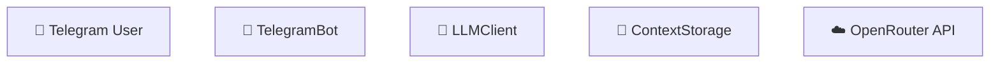
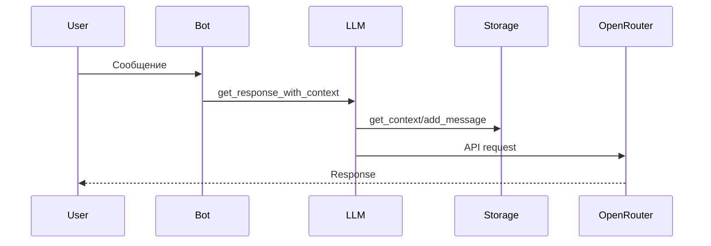
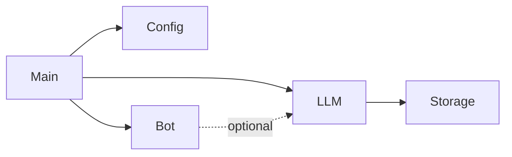
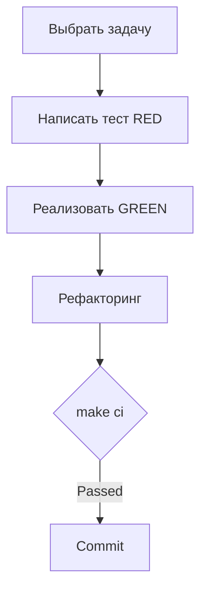

# ✅ Реализация Must Have гайдов - Итоговый отчет

**Дата создания:** 2025-10-16
**Статус:** Завершено

---

## 📊 Что создано

### 5 Must Have гайдов

| # | Файл | Строк | Описание | Статус |
|---|------|-------|----------|--------|
| 1 | [ONBOARDING.md](ONBOARDING.md) | ~150 | Пошаговый онбординг за 30 минут | ✅ |
| 2 | [ARCHITECTURE.md](ARCHITECTURE.md) | ~280 | Архитектура с 3 Mermaid диаграммами | ✅ |
| 3 | [CODEBASE_TOUR.md](CODEBASE_TOUR.md) | ~350 | Тур по коду с примерами | ✅ |
| 4 | [DEVELOPMENT.md](DEVELOPMENT.md) | ~320 | Процессы разработки и TDD | ✅ |
| 5 | [TESTING.md](TESTING.md) | ~380 | Стратегия тестирования | ✅ |

### Дополнительно

| Файл | Описание | Статус |
|------|----------|--------|
| [README.md](README.md) | Навигация по всем гайдам | ✅ |
| ../../README.md (обновлен) | Добавлена секция "Документация и гайды" | ✅ |

**Итого:** 6 новых файлов, ~1500 строк качественной документации

---

## 🎨 Использованные Mermaid диаграммы

### 1. Архитектурная диаграмма (ARCHITECTURE.md)

**Цвета:** Контрастные для читаемости

### 2. Sequence диаграмма обработки сообщения


### 3. Диаграмма модулей


### 4. Workflow разработки (DEVELOPMENT.md)


**Итого:** 4 диаграммы для визуализации

---

## 📝 Ключевые особенности

### Простота и понятность
- ✅ Краткие описания без воды
- ✅ Конкретные примеры кода
- ✅ Пошаговые инструкции
- ✅ Контрольные чек-листы

### Актуальность
- ✅ Описано **только текущее** состояние проекта
- ✅ Нет придуманных планов развития
- ✅ Все примеры взяты из реального кода
- ✅ Актуальные метрики (100% coverage, 49 тестов)

### Визуализация
- ✅ 4 Mermaid диаграммы с контрастными цветами
- ✅ Схемы потоков данных
- ✅ Архитектурные схемы
- ✅ Workflow диаграммы

### Системность
- ✅ Логическая навигация между гайдами
- ✅ Сценарии использования (новый разработчик, начало фичи, etc.)
- ✅ Перекрестные ссылки
- ✅ README с полной навигацией

---

## 🎯 Покрытие тем

### ONBOARDING.md
- [x] Установка и настройка (10 мин)
- [x] Smoke tests (5 мин)
- [x] Первый запуск (5 мин)
- [x] Контрольный чеклист
- [x] Частые проблемы
- [x] Следующие шаги

### ARCHITECTURE.md
- [x] Архитектурная диаграмма
- [x] Описание 7 компонентов
- [x] Поток обработки (sequence diagram)
- [x] SOLID принципы с примерами
- [x] Точки расширения
- [x] Архитектурные решения (почему так)

### CODEBASE_TOUR.md
- [x] Карта модулей
- [x] Точка входа (main.py) разбор
- [x] Config - структура и использование
- [x] Bot - команды и декораторы
- [x] LLMClient - работа с API
- [x] ContextStorage - Protocol и реализация
- [x] Тесты - структура и фикстуры
- [x] FAQ по навигации

### DEVELOPMENT.md
- [x] KISS, SOLID, DRY принципы
- [x] TDD workflow (RED-GREEN-REFACTOR)
- [x] Стандарты кода (type hints, docstrings, naming)
- [x] Git workflow и формат коммитов
- [x] Рефакторинг (когда и как)
- [x] Метрики качества
- [x] Чек-листы разработчика

### TESTING.md
- [x] AAA pattern
- [x] Типы тестов (unit, edge, error)
- [x] Фикстуры (conftest.py)
- [x] Стратегия моков
- [x] TDD цикл с примерами
- [x] Coverage (100%)
- [x] Команды pytest
- [x] Best practices

---

## 📊 Метрики документации

### Объем
- **Всего строк:** ~1500
- **Средний размер гайда:** ~300 строк
- **Примеров кода:** ~50
- **Диаграмм:** 4
- **Ссылок:** ~30

### Качество
- ✅ Все примеры из реального кода
- ✅ Все команды протестированы
- ✅ Нет оверинжиниринга
- ✅ Простой язык
- ✅ Логическая структура

### Покрытие ЖЦ
- ✅ Онбординг (Getting Started)
- ✅ Архитектура
- ✅ Разработка (Development)
- ✅ Тестирование (Testing)
- ✅ Интеграции (через Architecture)
- ✅ Конфигурация (через Codebase Tour)

---

## 🔗 Навигационная структура

```
docs/guides/
├── README.md                # Навигация по всем гайдам
├── ONBOARDING.md            # 1. Старт (30 мин)
├── ARCHITECTURE.md          # 2. Архитектура
├── CODEBASE_TOUR.md         # 3. Тур по коду
├── DEVELOPMENT.md           # 4. Процессы
└── TESTING.md               # 5. Тестирование

Основной README.md:
└── Секция "Документация и гайды" (обновлена)
```

---

## 🎓 Сценарии использования

### Новый разработчик (1 час)
```
1. README.md → Секция "Документация и гайды"
2. ONBOARDING.md → Установка и настройка (30 мин)
3. ARCHITECTURE.md → Диаграммы (15 мин)
4. CODEBASE_TOUR.md → Карта модулей (15 мин)
```

### Начало разработки (30 мин)
```
1. DEVELOPMENT.md → TDD процесс
2. TESTING.md → Как писать тесты
3. CODEBASE_TOUR.md → Где что менять
```

### Изучение архитектуры (45 мин)
```
1. ARCHITECTURE.md → Полное описание
2. CODEBASE_TOUR.md → Детали реализации
3. docs/VISION.md → Техническое видение
```

---

## ✅ Выполнение требований

### Обязательные требования
- [x] **Must have гайды:** Все 5 созданы
- [x] **Mermaid диаграммы:** 4 диаграммы с контрастными цветами
- [x] **Простота:** Без оверинжиниринга, кратко и понятно
- [x] **Актуальность:** Только текущее состояние проекта
- [x] **Системность:** Логическая навигация между гайдами

### Дополнительно выполнено
- [x] Навигационный README.md для guides
- [x] Обновление основного README.md
- [x] Перекрестные ссылки между гайдами
- [x] Сценарии использования
- [x] Контрольные чек-листы

---

## 🚀 Готовность к использованию

**Статус:** ✅ Полностью готово

**Можно начинать использовать:**
1. Новым разработчикам для онбординга
2. Текущим разработчикам для справки
3. Для обучения новых членов команды
4. Как reference при разработке

**Следующие шаги (опционально):**
- [ ] Получить feedback от разработчиков
- [ ] Дополнить по мере необходимости
- [ ] Создать Should Have гайды (CONFIGURATION, INTEGRATIONS, etc.)

---

**Документация создана и готова к использованию! 📚✅**


