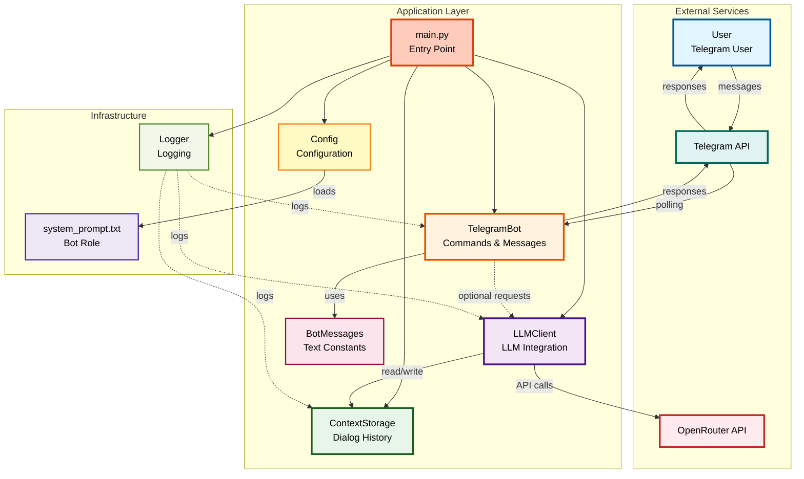
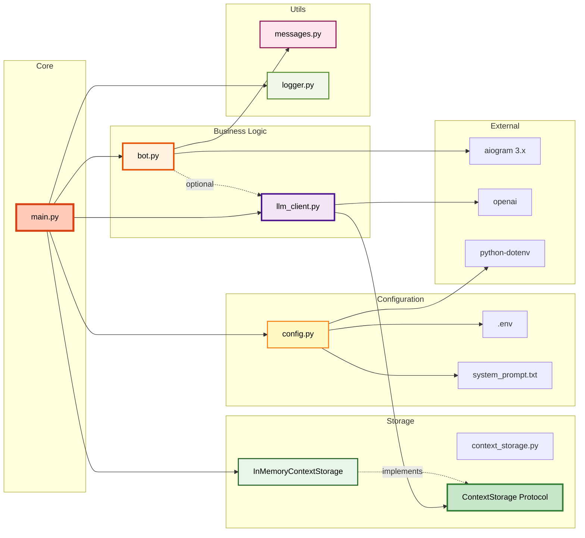
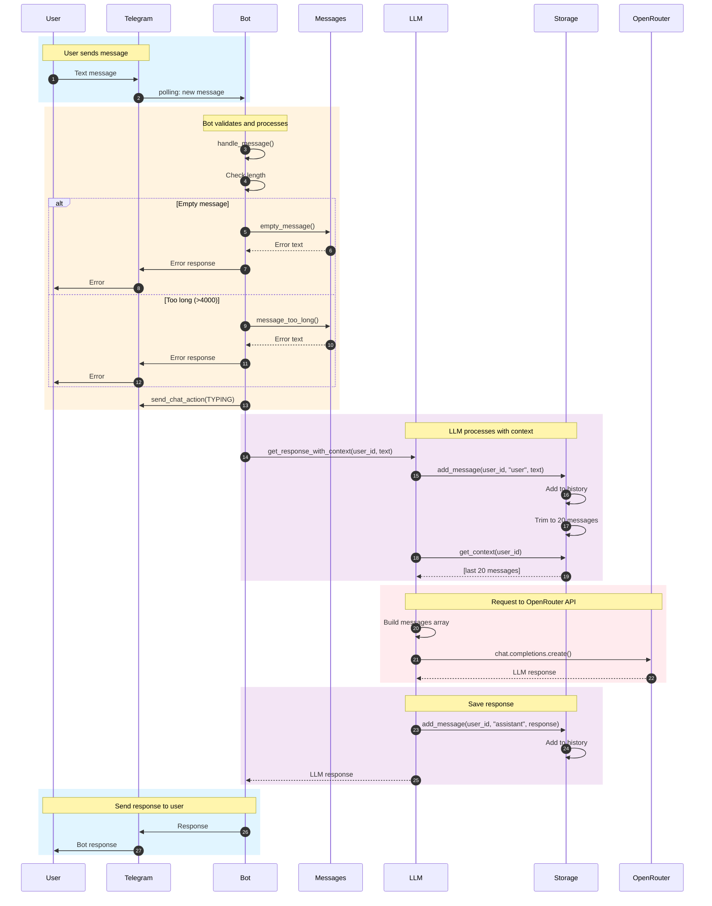
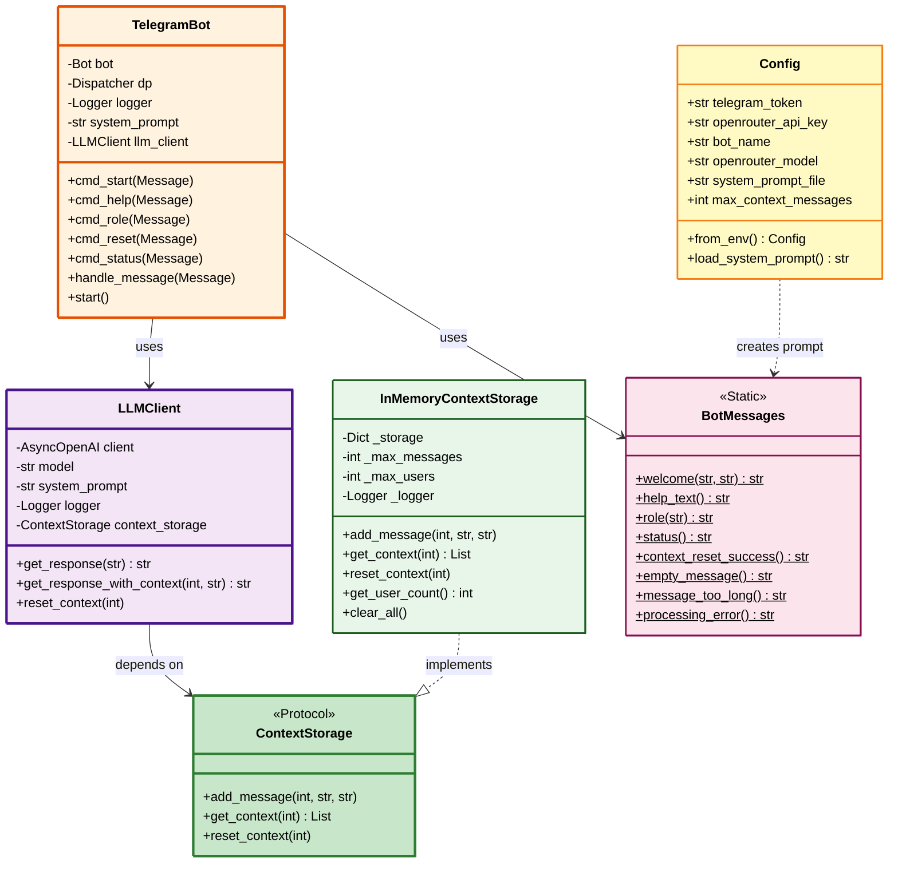
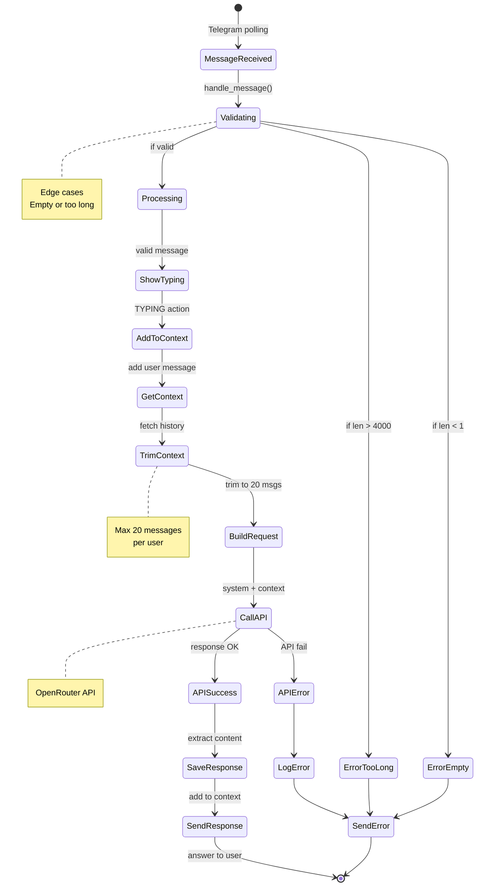
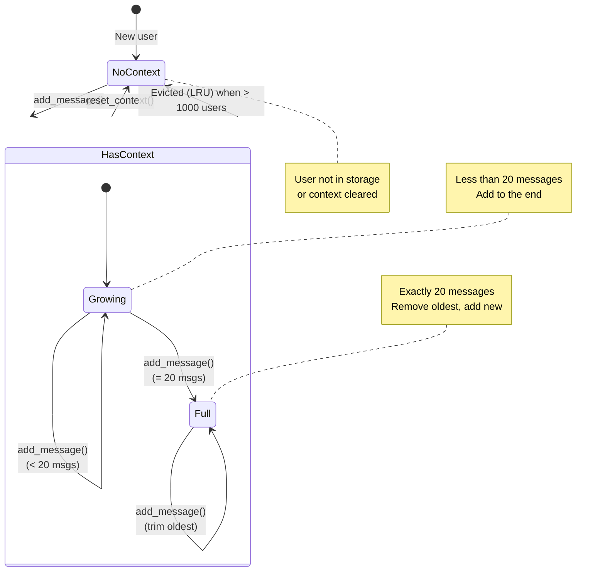
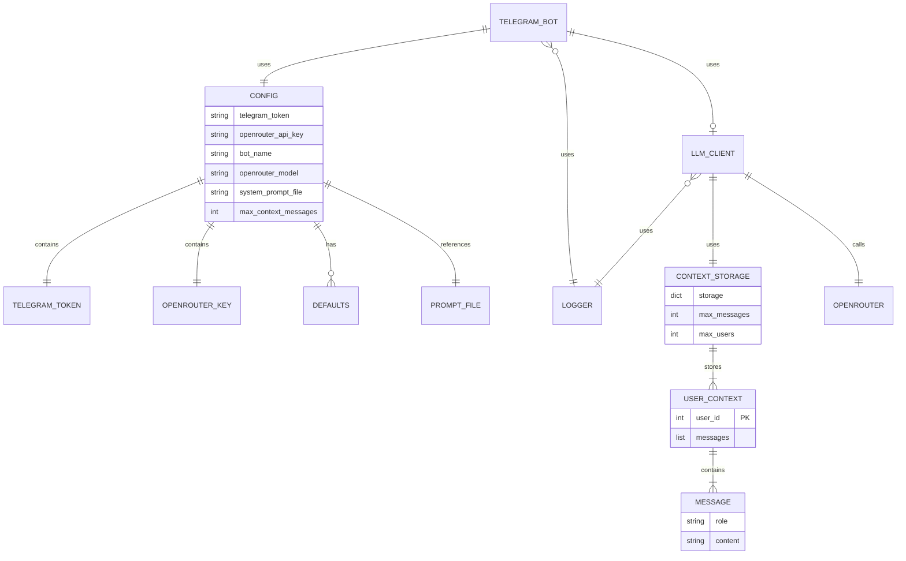
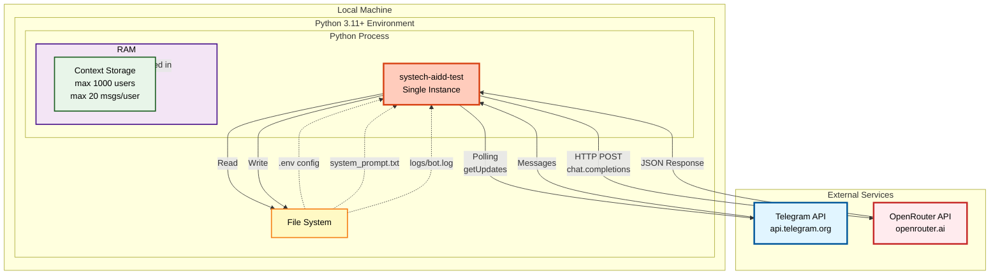
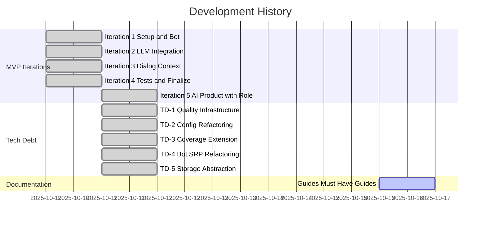
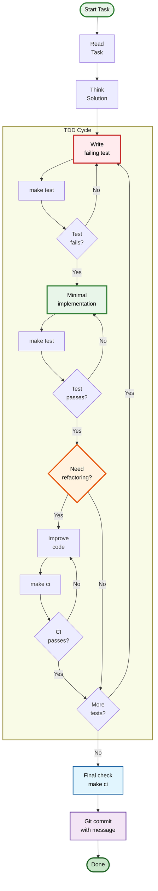

# 📊 Визуальное руководство по проекту

> Понимание проекта через визуализацию с разных точек зрения

---

## 🎯 О гайде

Этот гайд показывает проект через **различные типы диаграмм**, каждая из которых раскрывает определенный аспект системы. Используйте нужную диаграмму в зависимости от того, что хотите понять.

---

## 📐 Содержание

1. [Высокоуровневая архитектура](#1-высокоуровневая-архитектура)
2. [Компоненты и зависимости](#2-компоненты-и-зависимости)
3. [Поток обработки сообщения](#3-поток-обработки-сообщения)
4. [Структура классов](#4-структура-классов)
5. [Жизненный цикл запроса](#5-жизненный-цикл-запроса)
6. [Состояния контекста](#6-состояния-контекста)
7. [Модель данных](#7-модель-данных)
8. [Развертывание](#8-развертывание)
9. [История разработки](#9-история-разработки)
10. [Процесс разработки (TDD)](#10-процесс-разработки-tdd)

---

## 1. Высокоуровневая архитектура

**Что показывает:** Основные компоненты и их взаимодействие

**Ключевые наблюдения:**
- 🚀 **main.py** - оркестратор, создает все компоненты
- 🤖 **Bot** - единственная точка входа от Telegram
- 🧠 **LLM** - изолирован от Telegram (можно использовать отдельно)
- 💾 **Storage** - pluggable (Protocol-based)

---

## 2. Компоненты и зависимости

**Что показывает:** Иерархия модулей и направление зависимостей

**Принцип зависимостей:**
- ⬇️ Зависимости направлены **вниз** (от абстракций к деталям)
- 🔄 Нет циклических зависимостей
- 📦 Storage использует Protocol (Dependency Inversion)

---

## 3. Поток обработки сообщения

**Что показывает:** Последовательность действий при получении сообщения

**Временная сложность:** ~1-3 секунды на сообщение (зависит от OpenRouter)

---

## 4. Структура классов

**Что показывает:** Классы, их атрибуты и методы

**Паттерны:**
- 🔷 **Protocol** - ContextStorage (Dependency Inversion)
- 🔶 **Static Methods** - BotMessages (stateless)
- 🔹 **Decorator** - @log_command (AOP pattern)
- 🔸 **Factory Method** - Config.from_env()

---

## 5. Жизненный цикл запроса

**Что показывает:** Состояния запроса от начала до конца

**Точки отказа:**
- ❌ Валидация (пустое/длинное сообщение)
- ❌ API ошибка (сеть, лимиты, ключ)
- ✅ Все ошибки логируются и обрабатываются gracefully

---

## 6. Состояния контекста

**Что показывает:** Как изменяется контекст диалога

**Стратегии:**
- 🔄 **FIFO** для одного пользователя (при > 20 сообщений)
- 🔄 **LRU** для всех пользователей (при > 1000 пользователей)

---

## 7. Модель данных

**Что показывает:** Структуры данных и их связи

**Ограничения:**
- 📊 **20 сообщений** на пользователя
- 👥 **1000 пользователей** максимум
- 📝 **4000 символов** максимум в сообщении

---

## 8. Развертывание

**Что показывает:** Текущая архитектура развертывания

**Характеристики:**
- 🖥️ Single instance (не распределенная)
- 💾 In-memory storage (не персистентная)
- 🔄 Polling mode (не webhook)
- 📦 Нет контейнеризации (запуск через make run)

**Готовность к масштабированию:**
- ✅ Protocol-based storage → легко заменить на Redis
- ✅ Stateless design → можно запустить N инстансов
- ⚠️ Polling → нужно изменить на webhook

---

## 9. История разработки

**Что показывает:** Эволюция проекта по итерациям

**Ключевые вехи:**
- 📅 **День 1 (10.10):** MVP функционал (итерации 1-4)
- 📅 **День 2 (11.10):** AI-продукт + устранение тех.долга (TD-1 → TD-5)
- 📅 **День 7 (16.10):** Документация и гайды

**Метрики прогресса:**
- Итерация 1 → 4: **0% → 72%** test coverage
- TD-3: **72% → 100%** test coverage
- TD-1 → TD-5: **0 → 49** тестов

---

## 10. Процесс разработки (TDD)

**Что показывает:** Workflow TDD цикла

**Правила TDD:**
1. 🔴 **RED:** Тест ДОЛЖЕН упасть (проверяем правильность теста)
2. 🟢 **GREEN:** Минимальный код для прохождения (не больше!)
3. ♻️ **REFACTOR:** Улучшаем только если нужно (KISS!)

---

## 🎨 Легенда цветов

### Компоненты
- 🟠 **Оранжевый** - Точка входа (main.py, Bot)
- 🟣 **Фиолетовый** - Бизнес-логика (LLM)
- 🟢 **Зеленый** - Хранилище (Storage)
- 🟡 **Желтый** - Конфигурация
- 🔴 **Красный** - Внешние API
- 🔵 **Синий** - Telegram

### Состояния
- 🟢 **Зеленый** - Успех, валидный
- 🔴 **Красный** - Ошибка, провал
- 🟡 **Желтый** - В процессе
- 🟣 **Фиолетовый** - Проверка

---

## 📚 Навигация по диаграммам

### Хочу понять общую архитектуру
→ [1. Высокоуровневая архитектура](#1-высокоуровневая-архитектура)

### Хочу понять зависимости модулей
→ [2. Компоненты и зависимости](#2-компоненты-и-зависимости)

### Хочу понять как обрабатывается сообщение
→ [3. Поток обработки сообщения](#3-поток-обработки-сообщения)

### Хочу понять структуру классов
→ [4. Структура классов](#4-структура-классов)

### Хочу понять состояния запроса
→ [5. Жизненный цикл запроса](#5-жизненный-цикл-запроса)

### Хочу понять работу контекста
→ [6. Состояния контекста](#6-состояния-контекста)

### Хочу понять модель данных
→ [7. Модель данных](#7-модель-данных)

### Хочу понять развертывание
→ [8. Развертывание](#8-развертывание)

### Хочу понять историю проекта
→ [9. История разработки](#9-история-разработки)

### Хочу понять процесс разработки
→ [10. Процесс разработки (TDD)](#10-процесс-разработки-tdd)

---

## 🔗 Связанные гайды

- **[ARCHITECTURE.md](ARCHITECTURE.md)** - Текстовое описание архитектуры
- **[CODEBASE_TOUR.md](CODEBASE_TOUR.md)** - Тур по коду с примерами
- **[DEVELOPMENT.md](DEVELOPMENT.md)** - Процессы разработки
- **[TESTING.md](TESTING.md)** - Стратегия тестирования

---

**Используйте визуализацию для быстрого понимания системы! 📊**
